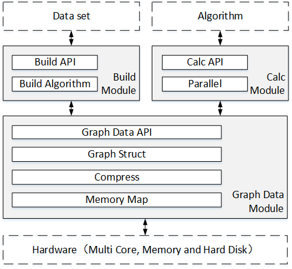

# DGraph
  DGraph is a large-scale graph processing system.
  
  It gives you simple APIs and very fast computing speed.
  
  Its core algorithm is SCC-DAG execution model.

## Start Up
### Install
``` shell
mkdir WorkSpace
cd WorkSpace
mkdir bin
git clone <DGraph git URL>
cd DGraph
make
make install
```
After install, the execute files are in bin dir like
```
bfs
build_normal
build_scc_dag
build.sh
k-core
pagerank
sssp
```

### Run
First, we need to generate DGraph files(preprocessing) from a certain original graph dataset. After that, we can run many algortihms on the DGraph files.
#### Preprocessing graph dataset
1. Prepare a dataset
 
  You can get dataset from [SNAP](http://snap.stanford.edu/data/)
    
  Dataset format that DGraph supports: 
    
    (1) Adj-format: 
    
        0 232 3423 324
        1 100 234 232 3324
        2 324 45 65 2324
        ...
        
    (2) Edge-list:
    
        0 232
        0 3423
        0 324
        1 100
        1 234
        1 232
        ...
        

2. Generate DGraph files
  ``` shell
  cd WorkSpace
  mkdir test
  ./bin/build.sh <dataset.txt> test
  ```
  And this dataset's DGraph files are:

  ```
  bor_pg_vtxs_in.bin
  bor_pg_vtxs_out.bin
  calc_vid_order.bin
  degree_pg_vtxs_in.bin
  degree_pg_vtxs_out.bin
  index_pg_vtxs_in.bin
  index_pg_vtxs_out.bin
  pg_id_to_vid.bin
  pg_vid_to_id.bin
  scc_group.bin
  scc_topo_level.bin
  ```
  
#### Run algorithm
Eg: PageRank
``` shell
#See Usage:
./bin/pagerank
```
You get
``` shell
Usage ./pagerank <data dir> <generate value to dir> <thread num(default processor num)><print top(default 10)>
```
Run PageRank
``` shell
./bin/pagerank test test
```
And you get results like
``` shell
Loading SCC DAG data...
initialize vtxs data (vtxs num: 735322)
Initialize value container
Initialize scc data
Load success.
Thread num: 16
asyn para run

(Time: 1473046251624 delta: 363)
Top value:
0:	0.0418388
73532:	0.0838599
147064:	0.118305
220596:	0.273202
294128:	0.037107
367660:	0.0410002
441192:	0.210406
514724:	0.0498573
588256:	0.120761
661788:	0.0442025
```

### Write a self-designed graph algorithm
1. Include DGraph API: **"api.h"**
1. Write a derived class of base class **SccDagApp**
2. Write **Constructor()**, **init()** and **update()** in derived template

Eg BFS:
``` cpp
#include "api.h"
#include <iostream>
#include <string>
#include <cstdlib>
#include <cmath>
#include <float.h>
#include <limits.h>

template <class App>
class BFSApp : public App
{
private:
	ID root;
public:
	BFSApp(ID root, string dir, string value_dir): App(dir, string("bfs_value.bin"), value_dir), root(root){};

	int min(int a, int b){return a < b ? a : b;}	

	void init(ID id, typename App::value_t &value)
	{
		if(id == root)	value = 0;
		else value = INT_MAX - 1;
	}

	bool update(ID virtual_id, typename App::bor_t inbor, typename App::bor_t outbor, bor_cnt_t in_cnt, bor_cnt_t out_cnt,
		const typename App::values_t rvalue, typename App::values_t wvalue)
	{
		int d = rvalue[virtual_id];

		ID idval = 0;
		PG_Foreach(inbor, idval)
		{
			d = min(d, rvalue[idval] + 1);
		}

		bool is_cvg = (d == wvalue[virtual_id]);
		wvalue[virtual_id] = d;
        return is_cvg;
	}
};

int main(int argc, char *argv[])
{
    if (argc != 3 && argc != 4 && argc != 5)
    {
            cout << "Usage ./bfs <data dir> <generate value to dir> <root(default 0)> <bfs.nt top(default 10)>" << endl;
            return 0;
    }

	ID root = ((argc == 4 || argc == 5) ? atoll(argv[3]) : 0);
	int top_num = (argc == 5 ? top_num = atoi(argv[4]) : 10) ;

	string dir(argv[1]), to_dir(argv[2]);
	BFSApp<SccDagApp<int>> bfs(root, dir, to_dir);

	cout << "sync para run" << endl; get_time(false);
	bfs.reset();
	bfs.para_run();

	cout << "asyn para run" << endl; get_time(false);
	bfs.reset(false);
	bfs.para_run();

	get_time(); cout << endl;
	bfs.print_top(top_num);

	return 0;
}

```


## DGraph Implementation
### Basic Algorithm: SCC-DAG execution model
Just waiting for our paper publishment :)
### System Implementation
To support SCC-DAG model, we have implemented a graph processing system, called DGraph1. It supports inmemory computing as well as out-of-core computing. 

#### 1. System Architecture
According to our SCC-DAG model, the DGraph has two stages, i.e., the preprocessing stage and the execution stage. In the preprocessing stage, it figures out SCCs, gets topological sorting and constructs sequential storage structure. In the execution stage, it executes different programs which are given by user according to different graph algorithms. The preprocessing stage is done only once to generate graph data files. After that, it is able to directly enter the execution stage to execute different graph algorithm as needed.

<div align="center">

<br>
Figure: The architecture of DGraph
</div>


The architecture of DGraph is depicted in Figure. It includes three modules. Upon hardware, there is a basic module, i.e., graph data module (GDM). It supplies efficient data access for out-of-core computing. Based on GDM, there are build module (BM) and calc module (CM). BM preprocesses the original graph dataset and generates compressed sequential storage structure. CM provides calc APIs for programmer to execute graph algorithm and automatically executes the graph algorithms in a parallel way. Programmer can implement different graph algorithm by invoking calc APIs.

#### 2. Optimization for Out-of-core Computing
The graph may be much larger than the memory size of a machine. In order to satisfy this requirement, DGraph is designed as an out-of-core computing system. It means that hard disk is leveraged to expand the size of memory. However, during the graph processing, data is frequently swapped between memory and hard disk and may induce low computing efficiency. 

<div align="center">

<br>
Figure: Sequential Storage Structure
</div>


**Sequential Storage Structure.** In order to exploit the high sequential bandwidth, graph data is often expected to be accessed in a sequential way. Consequently, we design a sequential storage structure for DGraph as described in Figure. As the above discussed, the level is processed sequentially. Therefore, we can use level ID to locate the sequence of SCCs in this level. After that, we can locate the sequence of vertices of a SCC and locate the edge data of a vertex. In this way, all data can be sequentially stored
and is allow to be sequentially accessed.

**Data Compressing.** To reduce the number of I/O operations, we compress the edge data to reduce the total volume of the graph. Because the edge data are sequentially stored and the data are integers, we use Base 128 Varints algorithm to compress. It is a sequential integer compress algorithm. The length of compress data is related to the digital size of number. The smaller the number be, the shorter the length of compress data is. Thus, we sort the edge ID of each vertex, and only compress the delta-value between an edge ID and next edge ID. Data compress brings some extra overhead. But to big graph, the benefits of reducing swap operation is more than the extra overhead.
